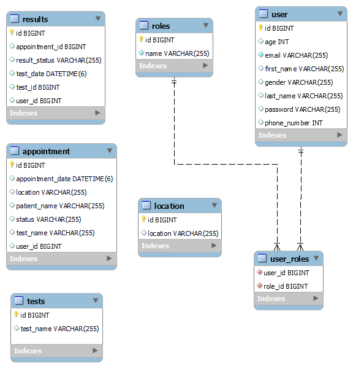

# labman

## About
This is a laboratory management system that helps to manage laboratory and patient appointments. The system has 3 roles
1. ADMIN
2. USER
3. LAB TECHNICIAN

Admin has bellow rights
- Manage Lab location
- Manage type of tests offered.
- Manage each appointment and change status.

User has permission to
- Schedule an appointment
- edit and reschedule appointments
- cancel appointments
- view the status of the appointments in real time such as
  - SCHEDULED
  - CHECKED_IN
  - SAMPLE_COLLECTED
  - RESULT_REVIEW
  - RESULT_READY

Finally, lab technician can find all the appointments and update the status based on the actions performed.

## Technologies Used

### Front End Layer
- HTML, CSS, Thymeleaf, Javascript.
### Api/Service Layer
- Sprint Boot, Thymeleaf, Spring Security, Spring JPA.
### Database
- MySQL

## Database Schema

## How to Setup Project Locally and Demo the app

1. Install MySQL/IntelliJ
2. Run the LabmanApplication, auto creates database(labmandb) and tables in mysql
3. Access http://localhost:8080
4. Click on Book an appointment, and create a user with admin role, when register use an email id starts with admin to register a new account
   eg: admin@test.com
5. Now, login to the application using admin@test.com. This use will be assigned role ADMIN.
6. Go to Manage Lab from side Nav and Add a Location eg: Los Angeles
7. Then add a Test eg: Covid 19 Tests.
8. Go to Schedule Appointment via left nav, and schedule an appointment.
9. Go to My Account and check the appointment is shown as recent appointment.
10. Note down the Code (eg: 1) from My Account and Go to Manage Appointment.
11. Put the Code (eg: 1) and click find appointment.
12. You can see the appointment listed and update the status to CHECKED_IN.
13. Go To My Account and see the status is changed to CHECKED_IN
14. Logout from the application navigated to Home Page.

Note: For demo purpose, each role is assigned for a user based on use email. 
   - If an email starts with prefix "admin", the user will be assigned to ADMIN role.
       eg: admin_user@labman.com
   - If a email starts with prefix "lt", the user will be assigned to Lab Technician role.
       eg: lt_user@labman.com
   - All other users will be assigned default USER Role.
       eg: user@labman.com

## Requirements covered for Capstone project
- Followed the defined Project Structure, Standardization, and Conventions.
- Added adequate unit tests for services and repository classes including parameterized tests.
  

